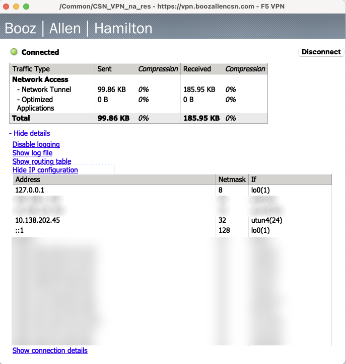

README.md   
   
# EMR cluster-based analysis on AI Training Platform

## Introduction

(NB: To view the markdown-formatted version of this file in VS Code: View -> Command Palette -> Markdown -> Markdown: Open Preview to the Side)

This document is intended for non-technical and technial users alike. It provides a step-by-step guide to running jobs on an EMR cluster from an EC2 instance. In our scenario, the EC2 instance has Neo4j running in a Docker container, which is the target for loading data from the EMR worker (i.e., core) nodes. The goal of the project is to develop an application suite that successfully runs jobs on the EMR cluster to load the data into Neo4j and then train one or more built-in machine learning algorithms.   
   
The rationale behind this infrastructure setup is that, for maximum efficiency, the Neo4j database should be installed on an EC2 instance connected to the EMR cluster. This is because the EMR cluster nodes are designed for processing data, not storing it. The EC2 instance can be configured with more storage and memory, which will improve the performance of the Neo4j database.   
   


## Operating system   
   
To save on setup time, you can choose an AMI (Amazon Machine Image) that has Neo4j already installed. Here's how we found the AMI we are using for this project:   
   
AWS Console -> SEARCH: AMI CATALOG -> COMMUNITY AMIs -> SEARCH: "NEO4J UBUNTU 22.04"   
   
The AMI details are as follows:   
   
#### neo4j VERSION: 5.7   
#### OS TYPE/VERSION: Ubuntu 22.04   
   
  Verified provider   
  websoft9-neo4j-community-5.7-UbuntuLTS22.04-4451506a-7dab-4bac-98e5-6f2b11e526cc   
  ami-0649656bd7a22cf9f   
  Platform: Ubuntu   
  Architecture: x86_64   
  Owner: 679593333241   
  Publish date: 2023-05-30   
  Root device type: ebs   
  Virtualization: hvm   
  ENA enabled: Yes   
  Select   
   
#### INSTANCE TYPE   
   
  t3.xlarge   
  Family: t3   
  4 vCPU   
  16 GiB Memory   
  Current generation: true   


## Development workflow    
   
In brief, the development workflow is as follows:   
    
1. SSH into the EMR Cluster Primary node   
2. Edit the .java file then compile it and build the jar.zip file   
3. Verify that the jar.zip file runs successfully   
4. Upload the jar.zip file to S3 and rename the local copy   
5. SSH into the EC2 instance   
6. Run python script to download and run the jar.zip file   
7. Verify the output. Repeat steps 1-6 until satisfied.   
8. Replace the test data with the full production data and run step 6 for the last time.   
    
Let's go into the details of the workflow on the command line.   
   

#### 1. SSH into the EMR Cluster Primary node   

If you haven't already, request CSN VPN access here (you can't access cloud resources using AnyConnect):

[Requesting CSN VPN access](https://confluence.boozallencsn.com/display/INFO/Requesting+CSN+VPN+Access)

As the page explains, you have to install the F5 VPN app to access the AWS console in your browser or any AWS resources on the command line (e.g., with AWS CLI). Install the F5 VPN app here:

https://vpn.boozallencsn.com

... and log in with your CSN credentials in order to download the F5 VPN client.

If you check your F5 connection details, you'll see you have an IP address like this:

10.138.x.x



All machines in the 10.138.x.x range can access the AI Training Platform account in the AWS console by browser. 

 Please note that, additional restrictions apply to accessing the ports of AWS compute resources like EC2 instances and containers. See [Appendix 2. Port access list](###appendix-2.-port-access-list) for the list of ports you can access by default and how to add to this list by making a port access request.

Next, locate the EMR cluster primary node in the AWS console.

SEARCH: EMR -> Search: <my-project> -> Click on cluster -> Instances -> Primary -> Click on instance ID -> Look for Private IP

Connect to the EMR cluster primary node:

```bash
ssh -i <my-project>.pem ec2-user@<PRIMARY-NODE-PRIVATE-IP>
```

 Note: Why is it 'ec2-user' and not 'ubuntu'? Because the EMR cluster we chose does not use Ubuntu as it's operating system. Rather it uses Redhat, Amazon Linux or some other non-Ubuntu flavour of Linux).   

#### 2. Edit the .java file then compile it and build the jar.zip file   

On the EMR cluster primary node, download the fraud-model-test.java (or your own .java file) from S3:

```bash
aws s3 cp --recursive s3://ai-txg-graph-2023/code .
```

Edit the .java file then compile it:

```bash
cd code
javac fraud-model-test.java
```

Move the .class file to your 'jar' folder:

```bash
mv fraud-model-test.class ../jar
```

Zip it up with your data file and the neo4j java driver and your data .csv file, and then move it to the base directory:

```bash
jar cvf jar.zip *
 added manifest
 adding: creditcard-10.csv(in = 4925) (out= 2440)(deflated 50%)
 adding: neo4j-java-driver-slim-4.12.0.jar(in = 291145) (out= 250880)(deflated 13%)
 adding: PreprocessingMapper.class(in = 4973) (out= 2200)(deflated 55%)

mv jar.zip ..
```

#### 3. Verify that the jar.zip file runs successfully

First, enable the hadoop command for your user ('ec2-user')

```bash
sudo usermod -aG hdfsadmingroup ec2-user
```

Log out of your SSH session, then connect again with SSH:

```bash
# EXIT EMR CLUSTER PRIMARY NODE
exit; exit; exit;

# LOG BACK IN FROM YOUR LAPTOP
ssh -i <my-project>.pem ec2-user@<PRIMARY-NODE-PRIVATE-IP>
```

Now, create the directory to house your input and output file folders:

```bash
hadoop fs -mkdir hdfs://ip-10-194-29-205.csn.internal:8020/user/ec2-user/
```

You can also copy any input files to an 'inputs' folder:

```bash
hadoop fs -mkdir hdfs://ip-10-194-29-205.csn.internal:8020/user/ec2-user/inputs
hadoop fs -put creditcard-10.csv hdfs://ip-10-194-29-205.csn.internal:8020/user/ec2-user/inputs

# VERIFY CONTENTS OF 'inputs' FOLDER
hadoop fs -ls creditcard-10.csv hdfs://ip-10-194-29-205.csn.internal:8020/user/ec2-user/inputs
```

  Note: When you run a job with the 'outputs' folder argument, it will fail if the folder already exists, e.g. this command:

```bash
hadoop jar jar.zip inputs outputs
```

... will fail if this folder already exists:

hdfs://ip-10-194-29-205.csn.internal:8020/user/ec2-user/outputs

But, you can just delete the folder before running the job:

```bash
hadoop fs -rmdir hdfs://ip-10-194-29-205.csn.internal:8020/user/ec2-user/outputs
```

Run the jar.zip file:

```bash
# JUST IN CASE
export CLASSPATH=`pwd`/code/target/neo4j-java-driver-slim-4.12.0.jar:$CLASSPATH

# NOW RUN IT
hadoop jar jar.zip PreprocessingMapper inputs outputs

 2023-07-07 18:47:49,415 INFO client.DefaultNoHARMFailoverProxyProvider: Connecting to ResourceManager at ip-10-194-29-205.csn.internal/10.194.29.205:8032
 2023-07-07 18:47:49,586 INFO client.AHSProxy: Connecting to Application History server at ip-10-194-29-205.csn.internal/10.194.29.205:10200
 2023-07-07 18:47:49,862 WARN mapreduce.JobResourceUploader: Hadoop command-line option parsing not performed. Implement the Tool interface and execute your application with ToolRunner to remedy this.
 2023-07-07 18:47:49,884 INFO mapreduce.JobResourceUploader: Disabling Erasure Coding for path: /tmp/hadoop-yarn/staging/ec2-user/.staging/job_1688754857121_0002
 2023-07-07 18:47:50,269 INFO input.FileInputFormat: Total input files to process : 0
 2023-07-07 18:47:50,404 INFO mapreduce.JobSubmitter: number of splits:0
 2023-07-07 18:47:50,583 INFO mapreduce.JobSubmitter: Submitting tokens for job: job_1688754857121_0002
 2023-07-07 18:47:50,583 INFO mapreduce.JobSubmitter: Executing with tokens: []
 2023-07-07 18:47:50,900 INFO conf.Configuration: resource-types.xml not found
 2023-07-07 18:47:50,901 INFO resource.ResourceUtils: Unable to find 'resource-types.xml'.
 2023-07-07 18:47:51,554 INFO impl.YarnClientImpl: Submitted application application_1688754857121_0002
 2023-07-07 18:47:51,691 INFO mapreduce.Job: The url to track the job: http://ip-10-194-29-205.csn.internal:20888/proxy/application_1688754857121_0002/
 2023-07-07 18:47:51,691 INFO mapreduce.Job: Running job: job_1688754857121_0002
 2023-07-07 18:48:00,810 INFO mapreduce.Job: Job job_1688754857121_0002 running in uber mode : false
 2023-07-07 18:48:00,811 INFO mapreduce.Job:  map 0% reduce 0%
 2023-07-07 18:48:07,883 INFO mapreduce.Job:  map 0% reduce 33%
 2023-07-07 18:48:10,897 INFO mapreduce.Job:  map 0% reduce 100%
 2023-07-07 18:48:10,907 INFO mapreduce.Job: Job job_1688754857121_0002 completed successfully
 2023-07-07 18:48:11,150 INFO mapreduce.Job: Counters: 41
  File System Counters
   FILE: Number of bytes read=0
   FILE: Number of bytes written=872279
   FILE: Number of read operations=0
   FILE: Number of large read operations=0
   FILE: Number of write operations=0
   HDFS: Number of bytes read=0
   HDFS: Number of bytes written=0
   HDFS: Number of read operations=15
   HDFS: Number of large read operations=0
   HDFS: Number of write operations=6
   HDFS: Number of bytes read erasure-coded=0
  Job Counters 
   Launched reduce tasks=3
   Total time spent by all maps in occupied slots (ms)=0
   Total time spent by all reduces in occupied slots (ms)=1350624
   Total time spent by all reduce tasks (ms)=15348
   Total vcore-milliseconds taken by all reduce tasks=15348
   Total megabyte-milliseconds taken by all reduce tasks=43219968
  Map-Reduce Framework
   Combine input records=0
   Combine output records=0
   Reduce input groups=0
   Reduce shuffle bytes=0
   Reduce input records=0
   Reduce output records=0
   Spilled Records=0
   Shuffled Maps =0
   Failed Shuffles=0
   Merged Map outputs=0
   GC time elapsed (ms)=259
   CPU time spent (ms)=1830
   Physical memory (bytes) snapshot=749363200
   Virtual memory (bytes) snapshot=12591017984
   Total committed heap usage (bytes)=571473920
   Peak Reduce Physical memory (bytes)=252178432
   Peak Reduce Virtual memory (bytes)=4197859328
  Shuffle Errors
   BAD_ID=0
   CONNECTION=0
   IO_ERROR=0
   WRONG_LENGTH=0
   WRONG_MAP=0
   WRONG_REDUCE=0
  File Output Format Counters 
   Bytes Written=0
```

You should see something like this in the 'outputs' directory on HDFS:

```bash
hadoop fs -ls hdfs://ip-10-194-29-205.csn.internal:8020/user/ec2-user/outputs

hadoop fs -ls hdfs://ip-10-194-29-205.csn.internal:8020/user/ec2-user/outputs

 Found 4 items
 -rw-r--r--   1 ec2-user hdfsadmingroup          0 2023-07-07 18:48 hdfs://ip-10-194-29-205.csn.internal:8020/user/ec2-user/outputs/_SUCCESS
 -rw-r--r--   1 ec2-user hdfsadmingroup          0 2023-07-07 18:48 hdfs://ip-10-194-29-205.csn.internal:8020/user/ec2-user/outputs/part-r-00000
 -rw-r--r--   1 ec2-user hdfsadmingroup          0 2023-07-07 18:48 hdfs://ip-10-194-29-205.csn.internal:8020/user/ec2-user/outputs/part-r-00001
 -rw-r--r--   1 ec2-user hdfsadmingroup          0 2023-07-07 18:48 hdfs://ip-10-194-29-205.csn.internal:8020/user/ec2-user/outputs/part-r-00002


hadoop fs -get hdfs://ip-10-194-29-205.csn.internal:8020/user/ec2-user/outputs

hadoop fs -get hdfs://ip-10-194-29-205.csn.internal:8020/user/ec2-user/outputs
tree outputs
 outputs
 ├── part-r-00000
 ├── part-r-00001
 ├── part-r-00002
 └── _SUCCESS

ll outputs/

 -rw-r--r-- 1 ec2-user ec2-user 0 Jul  7 19:03 part-r-00000
 -rw-r--r-- 1 ec2-user ec2-user 0 Jul  7 19:03 part-r-00001
 -rw-r--r-- 1 ec2-user ec2-user 0 Jul  7 19:03 part-r-00002
 -rw-r--r-- 1 ec2-user ec2-user 0 Jul  7 19:03 _SUCCESS
```

#### 4. Upload the jar.zip file to S3 and rename the local copy   

Copy the jar.zip file to S3 bucket:

```bash
aws s3 cp jar.zip  s3://ai-txg-graph-2023/data/

  upload: ./jar.zip to s3://ai-txg-graph-2023/data/jar.zip          
```

List the contents of the S3 bucket:

```bash
aws s3 ls s3://ai-txg-graph-2023/data/

 2023-07-06 21:14:15  150828752 creditcard.csv
 2023-07-07 19:06:06     540502 jar.zip
```

  Note: Don't forget to rename the local jar.zip file, just in case it messes up the EC2 instance python script-managed download of the jar.zip file from S3 to the EMR cluster primary node:

```bash
mv jar.zip jar.zip.bkp01
```

### 5. SSH into the EC2 instance

Using the .pem file you received from the AI Training platform admin team:

```bash
chmod 400 <my-project>.pem
ssh -i <my-project>.pem ubuntu@<EC2-INSTANCE-PRIVATE-IP>
```

### 6. Run python script to download and run the jar.zip file   

The script will download the jar.zip file onto the EMR cluster and run it:

```bash
python3 fraud-model-test.py
```

Edit the file to change the following values to match your setup:

cluster_id = '<EMR-CLUSTER-ID>'   
jar_zipfile = "s3://<my-project>/code/jar.zip"   
job_name = 'preprocessing-job'   
jar_file = 'PreprocessingMapper.jar'   
input_data_path = 's3://<my-project>/data/input'   
output_data_path = 's3://<my-project>/data/output'   
neo4j_endpoint_url = '<EC2-INSTANCE-PRIVATE-IP>:7474'   

For instructions and tips on accessing the Neo4j database, see [Appendix 1. Connect to Neo4j server](###-appendix-1.-connect-to-neo4j-server).

To enable and/or troubleshoot writing to S3 from Neo4j, see [Appendix 2. Exporting from Neo4j to S3](###-appendix-2.-exporting-from-neo4j-to-s3)

### 7. Verify the output. Repeat steps 1-6 until satisfied.   

Search the log files on the EMR cluster to troubleshoot EMR cluster jobs:

```bash
ls -al /usr/local/hadoop/logs/yarn--resourcemanager-core1.out
```

E.g., take a look in these folders:

```bash
/usr/local/hadoop/logs/yarn--resourcemanager-namenode.out
/usr/local/hadoop/logs/yarn-root-nodemanager-core1.out
/usr/local/hadoop/logs/yarn--resourcemanager-core2.out
```


### 8. Replace the test data with the full production data and run step 6.   

On the EMR cluster primary node, download the production data from your S3 bucket if you haven't already.

cd ~/jar
aws s3 cp s3://<my-project>/inputdata.csv

Zip up PreprocessinMapper.java, inputdata.csv and the neo4j java driver:


```bash
jar cvf jar.zip *
 added manifest
 adding: inputdata.csv(in = 423421346761345) (out= 423421224234230)(deflated 50%)
 adding: neo4j-java-driver-slim-4.12.0.jar(in = 291145) (out= 250880)(deflated 13%)
 adding: PreprocessingMapper.class(in = 4973) (out= 2200)(deflated 55%)
```

 This time, instead of moving the jar.zip file to the base directory, upload it to S3:

```bash
aws s3 cp jar.zip s3://<my-project>
```

Next, on the EC2 instance, run step 6 to launch the EMR cluster jobs:

```bash
python3 fraud-model-test.py
```

... and verify the outputs, hopefully for the last time!
   
   
## Appendices   
   
### Appendix 1. Connect to Neo4j server

The AMI we chose for the EC2 instance has Neo4j installed as a docker container. Use the following commands to connect to the Docker container and login to Neo4j.   
   
Show running containers on EC2 instance:   
   
```bash   
docker ps   
```   

If the container is not running or has some problems, you could delete any existing container and launch it again using the [Dockerfile](Dockerfile) provided with this README.

```bash
# LIST IMAGES
docker images

# BUILD IMAGE FROM SCRATCH IF IMAGE neo4j WITH TAG 5.7 NOT PRESENT
docker build - < Dockerfile

# NOW LAUNCH CONTAINER FROM IMAGE
docker run -d -it -v neo4j:/var/lib/neo4j \
-p 7473:7473 \
-p 7474:7474 \
-p 7687:7687 \
--volume=$HOME/neo4j/data:/data \
--env "NEO4J_AUTH=neo4j/AgZnuoJNMMI4Dp!" \
--env "APP_NAME=neo4j" \
--env "APP_DB_NEO4J_PASSWORD=AgZnuoJNMMI4Dp!" \
--env "APP_DB_NEO4J_USER=neo4j" \
--name neo4j \
neo4j:5.7
```

Assuming the container is running, connect to  the container:   
```bash   
docker exec -it neo4j /bin/bash   

# VERIFY neo4j IS RUNNING
neo4j status

 Neo4j is running at pid 7
```   
Login to the Neo4j database:   
```bash   
alias cs=cypher-shell   
cs -u neo4j -p AgZnuoJNMMI4Dp!   
   
 Connected to Neo4j using Bolt protocol version 5.2 at neo4j://localhost:7687 as user neo4j.   
 Type :help for a list of available commands or :exit to exit the shell.   
 Note that Cypher queries must end with a semicolon.   
 neo4j@neo4j>    
```   
   
In Neo4j, get help information:   
```bash   
:help   
```   
   
Show the default database:   
```bash   
  SHOW DEFAULT DATABASE;   
  +--------------------------------------------------------------------------------------------------------------------------------------------------------+   
  | name    | type       | aliases | access       | address          | role      | writer | requestedStatus | currentStatus | statusMessage | constituents |   
  +--------------------------------------------------------------------------------------------------------------------------------------------------------+   
  | "neo4j" | "standard" | []      | "read-write" | "localhost:7687" | "primary" | TRUE   | "online"        | "online"      | ""            | []           |   
  +--------------------------------------------------------------------------------------------------------------------------------------------------------+   
   
  1 row   
   
 ready to start consuming query after 1947 ms, results consumed after another 34 ms   
```   

Retrieve some data:
```bash
:use neo4j
MATCH (n) RETURN n LIMIT 5;

  +-------------------------------------------------------------------------------------------------------------+
  | n                                                                                                           |
  +-------------------------------------------------------------------------------------------------------------+
  | (:Client {name: "Bentley Peck", id: "4997933060327094"})                                                    |
  | (:Merchant {name: "MYrsa", id: "03-0000524"})                                                               |
  | (:CashIn:Transaction {globalStep: 1, amount: 129105.89322441132, fraud: FALSE, step: 1, id: "tx-1", ts: 1}) |
  | (:Merchant {name: "MFelics Ltd", id: "93-0006151"})                                                         |
  | (:CashIn:Transaction {globalStep: 2, amount: 299557.94653988, fraud: FALSE, step: 1, id: "tx-2", ts: 1})    |
  +-------------------------------------------------------------------------------------------------------------+
```

Show database schema:

```bash
CALL db.schema.visualization();
```

Create a new fraud detection model called 'fraud_detection_model' and train it on the data in file 'creditcard.csv':

```bash
 CREATE PROCEDURE train_fraud_detection_model()
 AS
 BEGIN
   MERGE (model:FraudDetectionModel {name: "fraud_detection_model"})
   WITH model
   CALL apoc.ml.train_logistic_regression(model, creditcard.csv);
 END;
```

To interact programatically with the database, use boto3 or neo4j Python libraries:   
   
### boto3 python module   
   
INSTALL   
   
```bash   
pip3 install boto3   
```   
CODE EXAMPLE   
   
SEE FILE [fraud-model-test.py](fraud-model-test.py)    
   
### neo4j python module   

SEE [https://neo4j.com/docs/python-manual/current/](https://neo4j.com/docs/python-manual/current/)

INSTALL   
   
```bash   
pip3 install neo4j   
```   
CODE EXAMPLE   
   
```bash   
from neo4j import GraphDatabase   
   
# URI examples: "neo4j://localhost", "neo4j+s://xxx.databases.neo4j.io"   
URI = "<URI for Neo4j database>"   
AUTH = ("<Username>", "<Password>")   
   
with GraphDatabase.driver(URI, auth=AUTH) as driver:   
    driver.verify_connectivity()   
```   

### Appendix 2. Exporting from Neo4j to S3   
   
[https://neo4j.com/labs/apoc/4.1/export/json/](https://neo4j.com/labs/apoc/4.1/export/json/)

By default, exporting to s3 is disabled. Enable it as follows:   
   
Verify the latest version (currently 4.4.0.19) of apoc-<version>.jar:
   
https://github.com/neo4j-contrib/neo4j-apoc-procedures/releases   
   
... and download it to the Neo4j plugins directory on the EC2 cluster primary node (inside the container if you are running one for Neo4j):   


```bash
cd /var/lib/neo4j/plug   
wget https://github.com/neo4j-contrib/neo4j-apoc-procedures/releases/download/4.4.0.19/apoc-4.4.0.19-all.jar   
chown neo4j:neo4j apoc-4.4.0.19-all.jar   
chmod 755 apoc-4.4.0.19-all.jar   
```

EDIT neo4j.conf:   
   
```bash
yum install -y emacs
emacs /var/lib/neo4j/conf/neo4j.conf   
```

REPLACE   
   
```bash
###dbms.security.procedures.whitelist=apoc.coll.*,apoc.load.*    
#dbms.security.procedures.allowlist=apoc.coll.*,apoc.load.*,gds.*    
```

WITH    
   
```bash
dbms.security.procedures.allowlist=apoc.coll.*,apoc.load.*,gds.*,apoc.*    
apoc.export.file.enabled=true   
```

RESTART NEO4J   
   
```bash
neo4j-admin server restart   

 (CONTAINER STOPS AND RESTARTS)   
   
 Stopping Neo4j.................ubuntu@ip-10-194-29-220:~$    
```   

RECONNECT TO CONTAINER   
   
```bash
docker exec -it neo4j /bin/bash   
```

Now log into Neo4j:   
   
```bash
alias cs=cypher-shell   
cs -u neo4j -p AgZnuoJNMMI4Dp!   
```

... and test out writing to S3 (assuming the 'exports' subfolder exists in your bucket):

```bash
CALL apoc.export.csv.query("MATCH (a:Person) RETURN  a.name as name",   
"s3://s3.sa-east-1.amazonaws.com/<my-project>/exports/neo4j_test.csv?accessKey   
```

### Appendix 3. Port access list

The following ports are open by default for the AI Training Platform account (813960883910):


If you need to add a port to this list, make a request using the instructions here:

[F5 Big-IP Port Access Request](https://confluence.boozallencsn.com/display/CKB/F5+Big-IP+Port+Access+Request)

